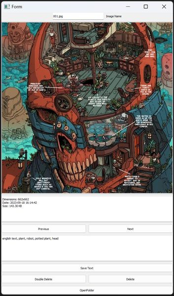
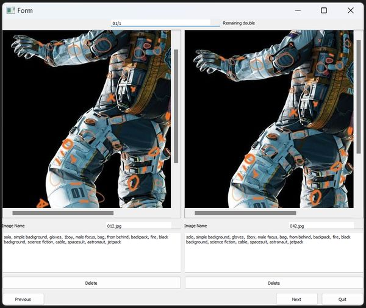

#  LoRA Image Viewer

LoRA Image Viewer is a PyQt5-based application that allows users to view and edit images and texts from a folder.

## Installation

### macOS:

 1. **Clone the GitHub repository**:

        git clone https://github.com/theandreburmet/LoRA-Image-Viewer
	    cd LoRA-Image-Viewer

  2. **Install the required dependencies**:
 It's recommended to use a virtual environment to prevent any dependency conflicts.

		 python3 -m venv venv
		 source venv/bin/activate
		 pip install -r requirements.txt

4. **Make the script executable**:

		chmod +x Lora_ImageViewer.sh

5. **Run the application**:

		./Lora_ImageViewer.sh

### Windows:
1. **Clone the GitHub repository**:
Open Git Bash or your preferred terminal.

	   git clone https://github.com/theandreburmet/LoRA-Image-Viewer.git
	   cd LoRA-Image-Viewer

2. **Install the required dependencies**: 
It's recommended to use a virtual environment to prevent any dependency conflicts.

		python -m venv venv
		.\venv\Scripts\activate
		pip install -r requirements.txt

3. **Run the application**:

		Lora_ImageViewer.bat
